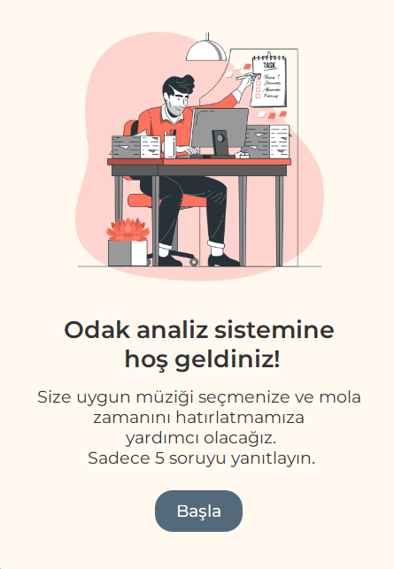
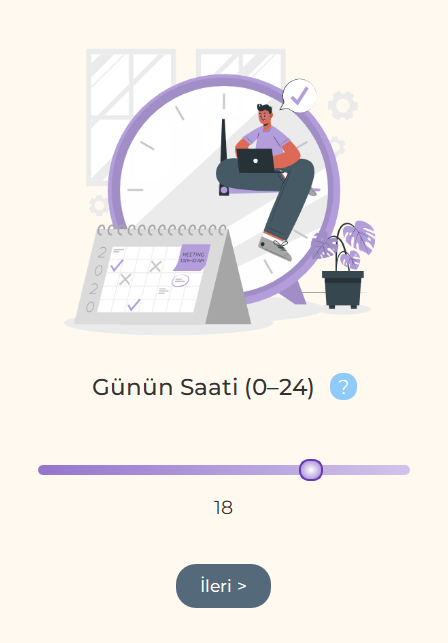

# 🎯 Focus Assistant — Bulanık Mantık Tabanlı Öneri Sistemi

Bu proje, **bulanık mantık (fuzzy logic)** kullanarak odaklanmayı artırmak ve ne zaman mola verilmesi gerektiğini öneren akıllı bir yardımcıdır. Proje, **Python** diliyle geliştirilmiş, **PyQt6** ile kullanıcı dostu bir grafik arayüz içermektedir ve **5 giriş**, **2 çıkış** içermektedir.

## 🔍 Proje Tanımı

Bu proje, günlük hayatta karşılaşılan uzun çalışma veya ders sürelerinde konsantrasyonun düşmesi ve yorgunluk problemini çözmeyi amaçlamaktadır. Sistem; ortam gürültüsü, dikkat dağıtıcı unsurlar, ruh hali, oturum süresi ve günün saatini analiz ederek aşağıdaki konularda öneriler sunar:

- 🎵 Müzik modu (sessizlik, yumuşak müzik, beyaz gürültü)
- ⏱️ Mola önerisi (devam et, yakında mola, hemen mola ver)

---

## 🧠 Girişler (Inputs)

| Parametre          | Açıklama                                   |
| ------------------ | ------------------------------------------ |
| `noise`            | Gürültü seviyesi (sessiz, orta, gürültülü) |
| `time_of_day`      | Günün saati (sabah, öğlen, akşam, gece)    |
| `session_duration` | Oturum süresi (kısa, orta, uzun)           |
| `distractions`     | Dikkat dağıtıcılar (az, orta, çok)         |
| `mood`             | Ruh hali (yorgun, normal, enerjik)         |

---

## 🎯 Çıkışlar (Outputs)

| Parametre          | Açıklama                                       |
| ------------------ | ---------------------------------------------- |
| `music_mode`       | Konsantrasyonu artırmak için önerilen ses modu |
| `break_suggestion` | Mola verilip verilmemesi önerisi               |

---

## 🧰 Kullanılan Teknolojiler

- 🐍 Python 3.x
- 🧠 `scikit-fuzzy` — bulanık mantık kontrol sistemi için
- 🎨 `PyQt6` — modern grafik kullanıcı arayüzü
- 🧪 `NumPy` — sayısal veri işlemleri için

---

## 🚀 Kurulum ve Başlatma

1. Depoyu klonlayın:
   ```bash
   git clone https://github.com/Ttoorne/focus-assistant__fuzzy-logic.git
   cd focus-assistant__fuzzy-logic
   ```
2. Gerekli bağımlılıkları yükleyin:

   ```bash
   pip install -r requirements.txt
   ```

3. Uygulamayı başlatın::

   ```bash
   python main.py
   ```

---

## 🖼️ Arayüz Görselleri

| Ana Ekran                      | Giriş Ekranı                 |
| ------------------------------ | ---------------------------- |
|  |  |

---

## 📊 Sistem Kuralları

Bu sistem, aşağıdaki gibi çeşitli durumlar için öneriler sunan **bulanık kurallar**a dayalıdır:

### Örnek Müzik Modu Kuralları

- Eğer ortam **sessiz** ve kullanıcı **enerjik** ise → `sessizlik`
- Eğer ortam **gürültülü** ve kullanıcı **yorgun** ise → `beyaz gürültü`
- Eğer günün saati **sabah** ve kullanıcı **enerjik** ise → `yumuşak müzik`

### Örnek Mola Kuralları

- Eğer oturum süresi **uzun** ya da dikkat dağıtıcılar **çok** ise → `hemen mola ver`
- Eğer kullanıcı **enerjik** ve dikkat dağıtıcılar **az** ise → `devam et`
- Eğer kullanıcı **yorgun** ise → `hemen mola ver`

Kuralların tamamı `fuzzy_logic.py` dosyasında tanımlanmıştır.

---

## 📁 Proje Yapısı

```bash
focus-assistant__fuzzy-logic/
├── fonts/                   # Özel yazı tipleri
├── images/                  # Uygulama görselleri ve animasyonlar
├── fuzzy_logic.py           # Bulanık mantık sistemi ve kurallar
├── main.py                  # PyQt6 arayüz ve uygulama akışı
├── requirements.txt         # Gerekli Python paketleri
└── README.md                # Proje açıklamaları
```
